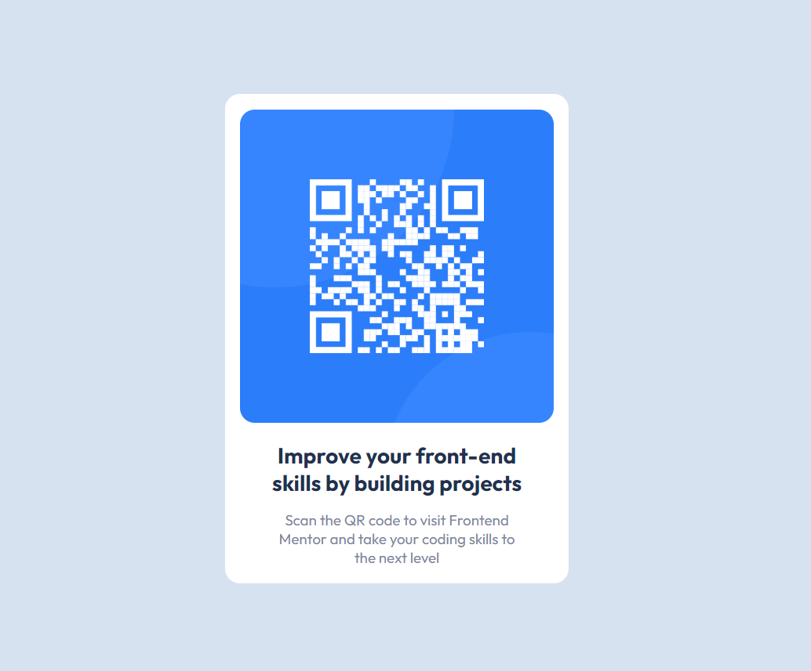
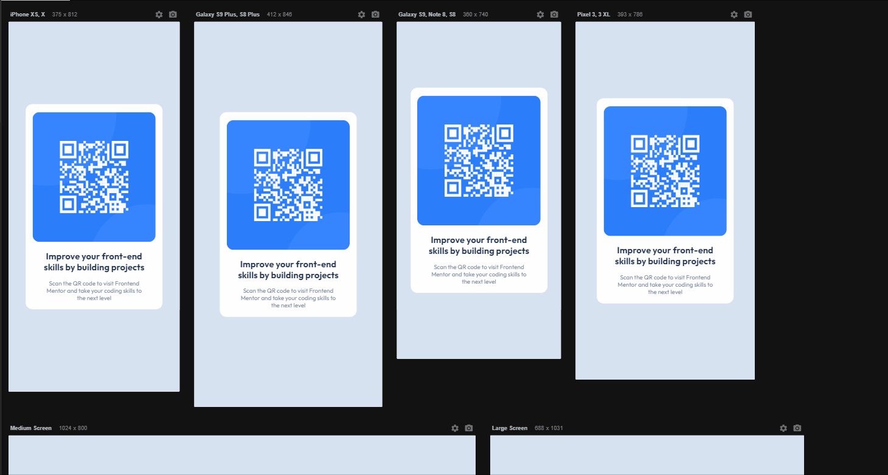

# Projeto Frontend Mentor  - QR code component solution

Desafio do site Frontend Mentor para construir um cartão com um QR code. 

[] (https://github.com/Geicimara-nunes/projeto-qr-code.git)

## O Projeto

Um cartão com um QR code que no desafio não era pedido um design responsivo, porém fiz um para telas menores de 576px para ficar visualmente melhor.

[]

### Linguagens utilizadas 

- HTML

- CSS
